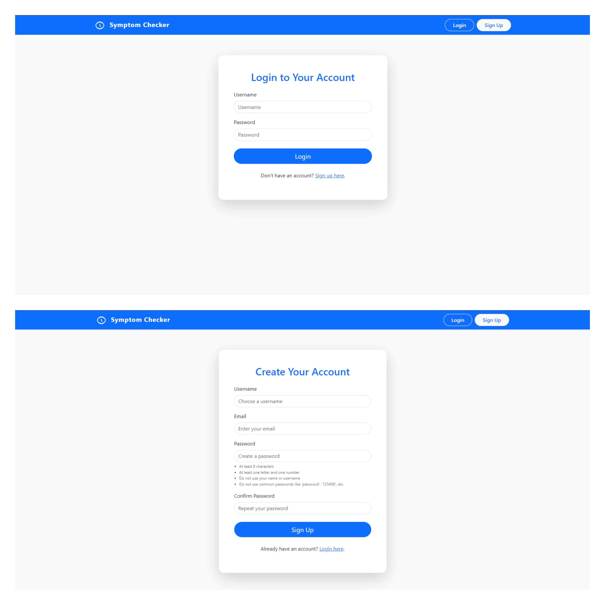
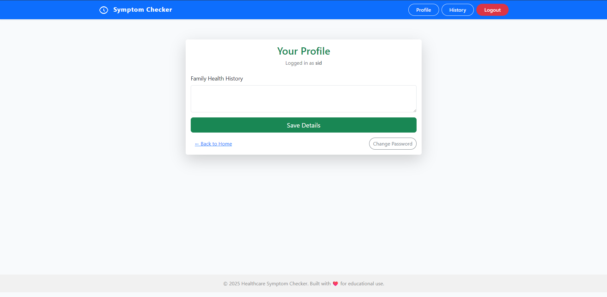
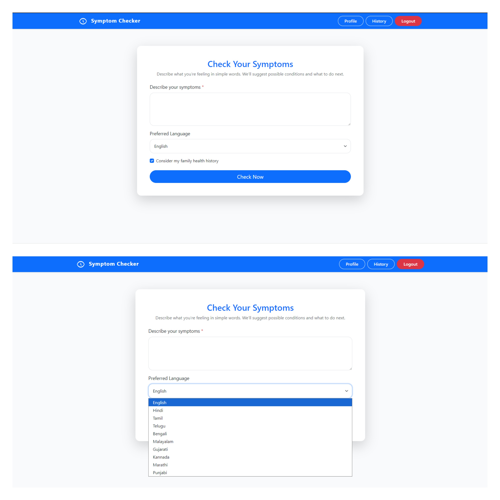
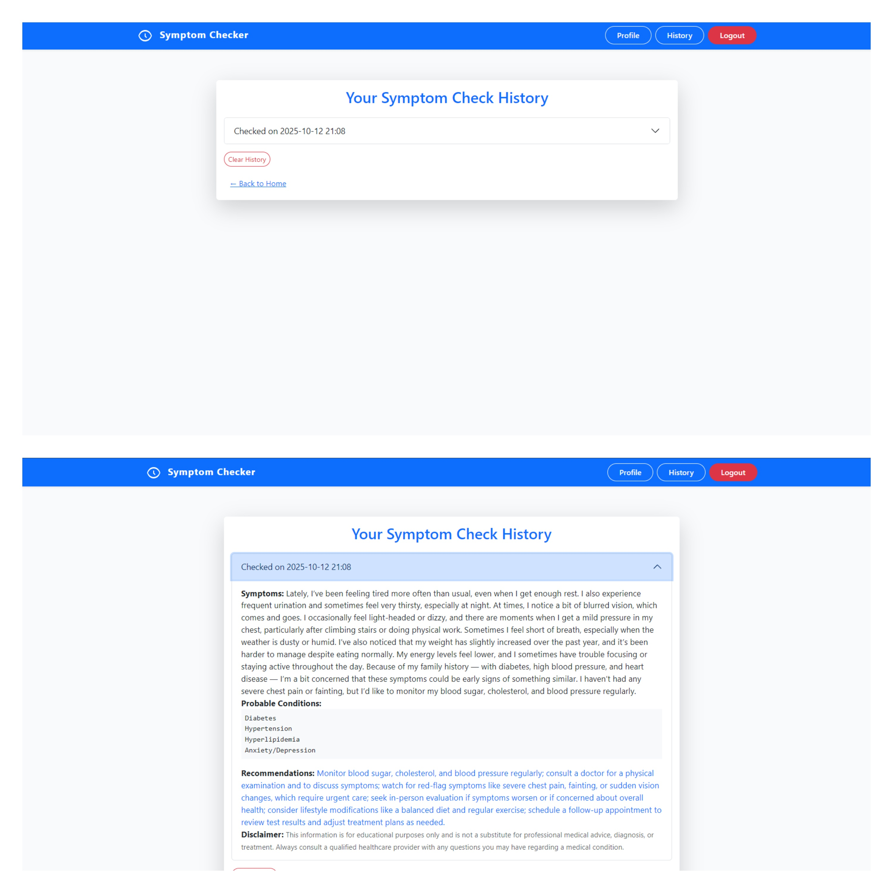

# Healthcare Symptom Checker

## Introduction
A simple, safe, and multilingual web app for checking symptoms and getting healthcare guidance. Designed for accessibility, Indian language support, and user privacy.

## Frameworks & Technologies Used
- **Frontend:** Django 5 (Python), Bootstrap 5 (HTML/CSS)
- **Backend:** FastAPI (Python), Hugging Face Inference API (LLM: meta-llama/Llama-3.1-70B-Instruct)
- **Database:** SQLite (shared by both services)
- **Translation:** googletrans (Google Translate API)
- **Containerization:** Docker, Docker Compose


## Main Features & Components
- **User authentication (signup, login, logout)**  
	
- **User profile with optional family medical history**  
	
- **Symptom checker form (with language selection and family history toggle)**  
	
- **LLM-powered, healthcare-only recommendations (JSON schema enforced)**
- **Multilingual output (supports major Indian languages)**
- **User history: view and clear past checks**
  
- **Admin panel for user/data management**
- **Accessible, mobile-friendly UI (aria-live, large controls)**

## Quickstart
### Docker (recommended)
```pwsh
docker compose up --build
```
- Frontend: http://localhost:8080
- Backend: http://localhost:8000

### Local (manual)
```pwsh
# Backend
python -m uvicorn backend.app:app --reload --port 8000
# Frontend
cd frontend
python manage.py runserver 8001
```

## API Reference (Backend)
- **POST** `/check?target_language=<code>`
	- Body: `{ "symptoms": string, "family_history"?: string }`
	- Returns: `{ "probable_conditions": string[], "recommendations": string, "disclaimer": string }`
- **GET** `/health`
	- Returns: `{ status: "ok", model: string, db: string }`

## Environment Variables
Place in `.env` (see `.env.example`):

| Name | Used by | Description |
|---|---|---|
| HF_TOKEN | Backend | Hugging Face API token (required) |
| MODEL_NAME | Backend | LLM model name (optional, default: meta-llama/Llama-3.1-70B-Instruct) |
| DATABASE_URL | Backend | Optional DB path (default: shared SQLite) |
| BACKEND_URL | Frontend | Optional; backend base URL (default: http://localhost:8000) |

## Troubleshooting & Notes
- If backend refuses requests, check `HF_TOKEN` in `.env`.
- Translation errors default to English output.
- Both services must see the same DB (`frontend/db.sqlite3`).
- For admin, create a superuser: `python manage.py createsuperuser` in `frontend`.
